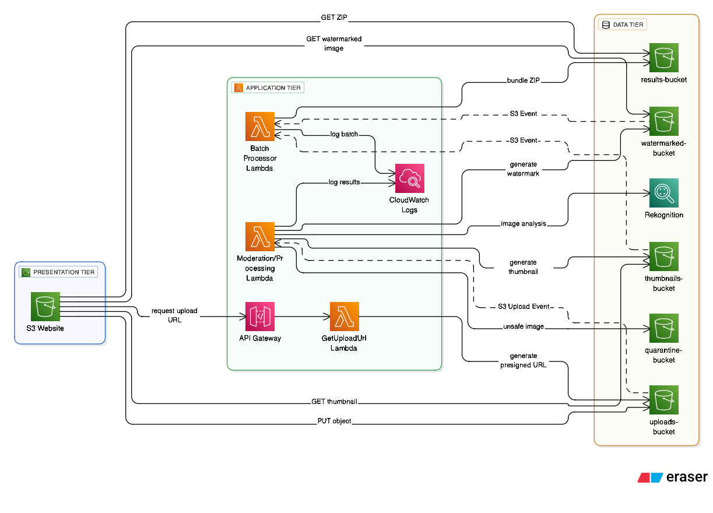

# CloudLens - Serverless Content Moderation & Processing Pipeline


**Course:** IT457 Cloud Computing  
**Institute:** Dhirubhai Ambani Institute of Information and Communication Technology (DA-IICT)

---

## Project Overview

**CloudLens** is a fully serverless, event-driven cloud application built on AWS. It provides a secure and automated pipeline for users to upload images, which are then automatically moderated for inappropriate content using AI and processed according to user requirements.

The entire architecture is designed to be scalable, cost-efficient, and maintainable, leveraging the power of AWS Lambda, S3, API Gateway, and Amazon Rekognition.

---

## Key Features

* **Automated AI Moderation:** Every uploaded image is scanned by **Amazon Rekognition**. Unsafe content is automatically flagged and quarantined before any processing occurs.
* **Serverless Architecture:** Zero server management. Scales automatically with traffic using AWS Lambda.
* **Secure Uploads:** Uses **S3 Presigned URLs** to allow direct, secure browser-to-S3 uploads without exposing AWS credentials.
* **Image Processing:**
    * **Watermarking:** Adds a custom, semi-transparent text watermark (diagonal & centered) based on user input.
    * **Thumbnail Generation:** Resizes images to user-defined dimensions using high-quality downsampling.
* **Batch Processing:** Supports uploading multiple images at once, with results automatically bundled into a ZIP file for download.
* **Monitoring:** Integrated CloudWatch logs for real-time tracking of processing status and safety blocks.

---

## Architecture

The system follows a **3-Tier Serverless Architecture**:


1.  **Frontend (Presentation Layer):** A static website hosted on Amazon S3 (`index.html`, `script.js`). It handles user interactions, secure file selection, and results display.
2.  **API Layer:** Amazon API Gateway acts as the secure entry point, triggering Lambda functions to generate short-lived upload credentials.
3.  **Backend (Logic & Data Layer):**
    * **AWS Lambda:** Executes business logic (Auth, Moderation, Processing).
    * **Amazon S3:** Stores raw uploads, processed outputs, and quarantined files.
    * **Amazon Rekognition:** Provides AI-powered content safety analysis.

### Data Flow

1.  **Request:** User selects file(s) → Frontend requests a secure upload URL from API Gateway.
2.  **Auth:** Lambda (`getUploadUrlLambda`) generates a **Presigned URL** with embedded metadata (action, custom text/size).
3.  **Upload:** Frontend uploads the file directly to the `uploads-bucket`.
4.  **Trigger:** S3 Upload Event automatically triggers the `moderationProcessor` Lambda.
5.  **Process:**
    * **Safety Check:** Calls Rekognition. If **Unsafe ❌** → Moves to `quarantine-bucket`.
    * **Transform:** If **Safe ✅** → Processes image (Watermark/Thumbnail) using Pillow → Saves to output buckets (`thumbnails` or `watermarked`).
6.  **Result:** Frontend polls the output bucket and provides a direct download link or ZIP archive.

---

## Tech Stack

| Category | Technology / Service | Usage |
| :--- | :--- | :--- |
| **Frontend** | HTML5, CSS3, JavaScript | User Interface & Client-side logic |
| **Compute** | AWS Lambda (Python 3.13) | Serverless backend logic |
| **Storage** | Amazon S3 | Object storage for files & hosting |
| **API** | Amazon API Gateway | HTTP API endpoint management |
| **AI/ML** | Amazon Rekognition | Content moderation (Safety check) |
| **Libraries** | Pillow (PIL) | Python image processing (Lambda Layer) |
| **Monitoring** | Amazon CloudWatch | Logs, Metrics, and Debugging |
| **Security** | AWS IAM | Role-based access control |

---

## Project Structure

```text
G34_CloudLens/
├── source_code/
│   ├── frontend/          # HTML, CSS, JS files for the web interface
│   │   ├── index.html
│   │   ├── script.js
│   │   ├── style.css
│   │   └── cloudlens_logo.png
│   │
│   ├── lambda_functions/  # Backend Logic
│   │   ├── getUploadUrlLambda.py  # Generates Presigned URLs
│   │   └── moderationProcessor.py # Core logic: Rekognition + Pillow
│   │
│   └── lambda_layer/      # Pillow library for AWS Lambda
│       └── pillow_layer_313.zip
│
├── aws_configuration/     # Security Policies
│   ├── static_bucket_policy.json
│   ├── thumbnails_bucket_policy.json
│   └── watermarked_bucket_policy.json
│
├── G34_Report.pdf         # Detailed final project report
├── presentation.pptx      # Project presentation slides   
└── README.md              # Project Documentation
```

---

## Setup & Deployment

### Prerequisites

  * AWS Account (Free Tier recommended)
  * Python 3.13 installed locally (for layer creation if needed)

### 1. Infrastructure Setup (AWS S3)

Create the following 5 S3 buckets (ensure unique names):

1.  `cloudlens-g34-static` (Enable **Static Website Hosting**)
2.  `cloudlens-g34-uploads` (Private, **CORS enabled**)
3.  `cloudlens-g34-thumbnails` (Public Read Policy)
4.  `cloudlens-g34-watermarked` (Public Read Policy)
5.  `cloudlens-g34-quarantine` (Private)

### 2. Backend Deployment (AWS Lambda)

#### **Function 1: `cloudlens-get-upload-url`**

  * **Code:** Upload `getUploadUrlLambda.py`.
  * **Environment Variable:**
      * `UPLOADS_BUCKET`: *<name-of-your-uploads-bucket>*
  * **Permissions:** IAM Role with `s3:PutObject` permission for the uploads bucket.
  * **Trigger:** Connect to **API Gateway** (HTTP API).

#### **Function 2: `cloudlens-processor`**

  * **Code:** Upload `moderationProcessor.py`.
  * **Layer:** Attach the Pillow Lambda Layer (Python 3.13 compatible).
  * **Environment Variables:**
      * `UPLOADS_BUCKET`: *<uploads-bucket-name>*
      * `THUMB_BUCKET`: *<thumbnails-bucket-name>*
      * `WATERMARK_BUCKET`: *<watermarked-bucket-name>*
      * `QUARANTINE_BUCKET`: *<quarantine-bucket-name>*
  * **Configuration:** Increase Timeout to **30s** and Memory to **512MB** (for image processing).
  * **Permissions:** IAM Role with access to S3 (Read/Write/Delete) and `rekognition:DetectModerationLabels`.
  * **Trigger:** Add an **S3 Event Notification** (All Object Create events) from the `uploads-bucket`.

### 3. Frontend Configuration

1.  Open `source_code/frontend/script.js`.
2.  Update the constants at the top with your deployed values:
    ```javascript
    const API_URL = "YOUR_API_GATEWAY_URL";
    const THUMB_BUCKET_URL = "https://YOUR_THUMBNAIL_BUCKET.s3.amazonaws.com";
    const WATERMARK_BUCKET_URL = "https://YOUR_WATERMARK_BUCKET.s3.amazonaws.com";
    ```
3.  Upload `index.html`, `style.css`, `script.js`, and `cloudlens_logo.png` to your **Static Website Bucket**.

---

## Contributors

  * **Nitesh Sachade:** Backend Logic, Rekognition Integration
  * **Swara Chokshi:** Infrastructure, Security (IAM), Monitoring
  * **Kishan Thanki:** Image Processing (Pillow), Lambda Layers
  * **Stuti Shah:** Frontend Development, API Integration

---

*For detailed technical information, please refer to the **CloudLens_Report.pdf** located in the root directory.*
